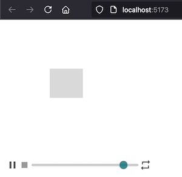

# Learning Lottie

Just one of the things I'm learning. <https://github.com/hchiam/learning>

Lottie files are a JSON-based image/animation format that uses [runtimes](https://lottiefiles.com/runtimes) to actually run them.

- <https://www.lottielab.com> Lottie***lab*** to actually create and export complex animations

- <https://lottiefiles.com> for [free animations](https://lottiefiles.com/featured-free-animations) and much more

- <https://lottiefiles.com/runtimes> for runtimes for Web, iOS, Android, React, VueJS, Svelte

  - ```js
    import { DotLottie } from '@lottiefiles/dotlottie-web';

    const dotLottie = new DotLottie({
        autoplay: true,
        loop: true,
        canvas: document.querySelector('#dotlottie-canvas'),
        src: "https://lottie.host/4db68bbd-31f6-4cd8-84eb-189de081159a/IGmMCqhzpt.lottie", // or .json file
    });
    ```

## Quickly create animations

- 2 steps in [Fireship.io tutorial](https://www.youtube.com/watch?v=UTHgr6NLeEw):
    1) **draw SVG shapes** in **Figma**, then
    2) **animate/interact**/etc. with **CSS/JS**.

or based on [this Lottie Figma plugin tutorial](https://www.youtube.com/watch?v=ajfKecCyNOs):

- [Lottie plugin](https://lottiefiles.com/plugins/figma) for [Figma](https://github.com/hchiam/learning-figma) makes it much easier to create animations than trying to manually code SVGs: <https://lottiefiles.com/plugins/figma>
    1) draw **frames** in **Figma** (use smart animate between frames) > select frames > **LottieFiles plugin** > **Export** to (a) Lottie file > **Save to workspace** > Download animation
        - you should be able to download a .json or .lottie file, etc.
        - (this will then also let you get a shareable handoff link in <https://app.lottiefiles.com> as well)
    2) bonus: Figma stroke paths will automatically get path animation suggestions in the LottieFiles plugin.

You might want to consider [Lottielab](https://www.lottielab.com) with/without Figma to generate [animations with curved paths](https://docs.lottielab.com/editor/canvas/layer-controls-huds/motion-path/curving-a-motion-path)

- <https://www.youtube.com/watch?v=j9KP44kj0gU>
- <https://www.youtube.com/watch?v=LooU8K3UgNE>

## Demo

Run

```sh
vite
```

to run `index.html` on <http://localhost:5173/>

```html
<script src="https://unpkg.com/@lottiefiles/lottie-player@latest/dist/lottie-player.js"></script>
<lottie-player
    src="./example.json"
    background="transparent"
    speed="1"
    style="width: 300px; height: 300px"
    loop
    controls
    autoplay
></lottie-player>
```




